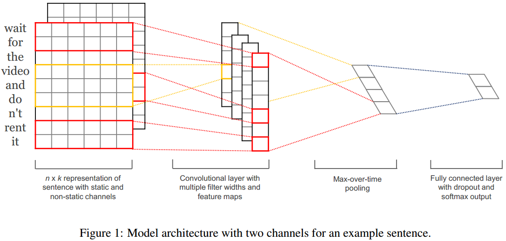
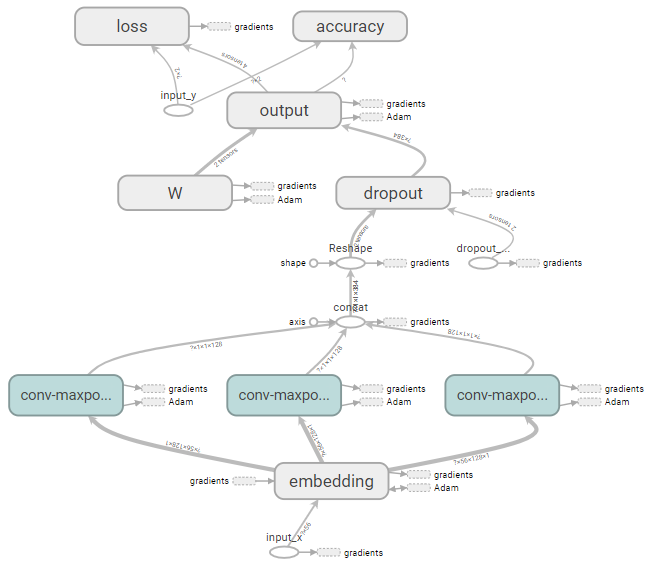

# Convolutional Neural Networks for Sentence Classification (Yoon Kim)
## 1.模型架构
- 论文模型

- 使用tensorboard
tensorboard --logdir=runs/1530857879
    - 网络结构 

## 2.实验
### 2.1 词向量
- tf.contrib.learn.preprocessing.VocabularyProcessor
- 使用word2vec
### 2.2 使用多个通道
方案：使用word2vec
### 2.3 在六个数据集上进行实验

| Model | MR | SST-1 | SST-2 | Subj | TREC | CR | MPQA |
| ------| ---| ------| ------| -----| -----| ---| -----|
| CNN-rand |  |  |  |  |  |  |  |
| CNN-static |  |  |  |  |  |  |  |
| CNN-non-static |  |  |  |  |  |  |  |
| CNN-multichannel |  |  |  |  |  |  |  |

## 3.使用GPU训练模型
## 4.讲模型扩展