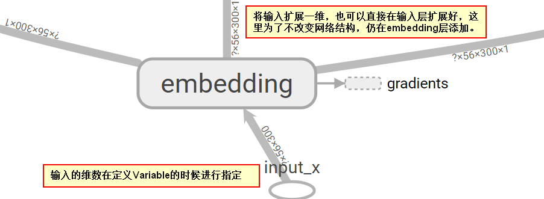

# Convolutional Neural Networks for Sentence Classification (Yoon Kim)
## 1.模型架构
- 论文模型

- 使用tensorboard
tensorboard --logdir=runs/1530857879
    - 网络结构 

## 2.实验
### 2.1 词向量
- tf.contrib.learn.preprocessing.VocabularyProcessor
- 使用word2vec 
改进后的网络结构如下：输入的每一个样本是一个56*300的向量

### 2.2 使用多个通道
方案：使用word2vec
### 2.3 在六个数据集上进行实验

| Model | MR | SST-1 | SST-2 | Subj | TREC | CR | MPQA |
| ------| ---| ------| ------| -----| -----| ---| -----|
| CNN-rand |  |  |  |  |  |  |  |
| CNN-static |  |  |  |  |  |  |  |
| CNN-non-static |  |  |  |  |  |  |  |
| CNN-multichannel |  |  |  |  |  |  |  |

## 3.使用GPU训练模型
## 4.模型扩展
### 4.1 Word2Vec的增量训练

目的：避免把全部的训练语料一次性载入到内存中。另一个原因是为了应对语料随时增加的情况。

### 4.2<a href="http://spark.apache.org/docs/latest/api/java/org/apache/spark/mllib/feature/Word2Vec.html">Word2Vec的分布式训练（基于spark mllib）</a>

### 4.3 Word2Vec用于中文数据(分布式训练)

### 参考：
[1] <a href="https://radimrehurek.com/gensim/models/word2vec.html">gensim word2vec</a> 
[2] <a href="">word2vec的分布式训练</a> 
[3] <a href="https://www.jianshu.com/p/6d542ff65b1e">word2vec中文训练</a>
